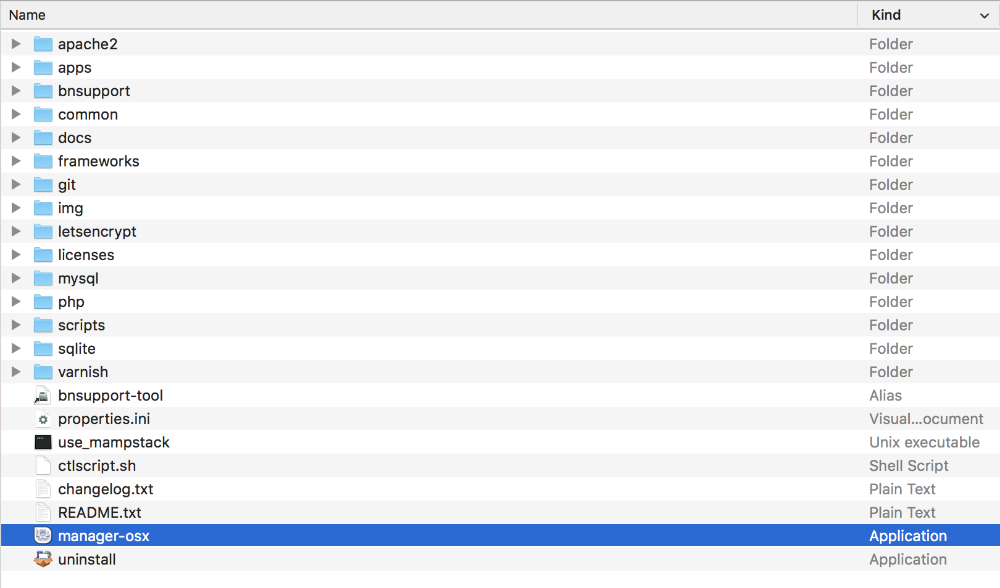
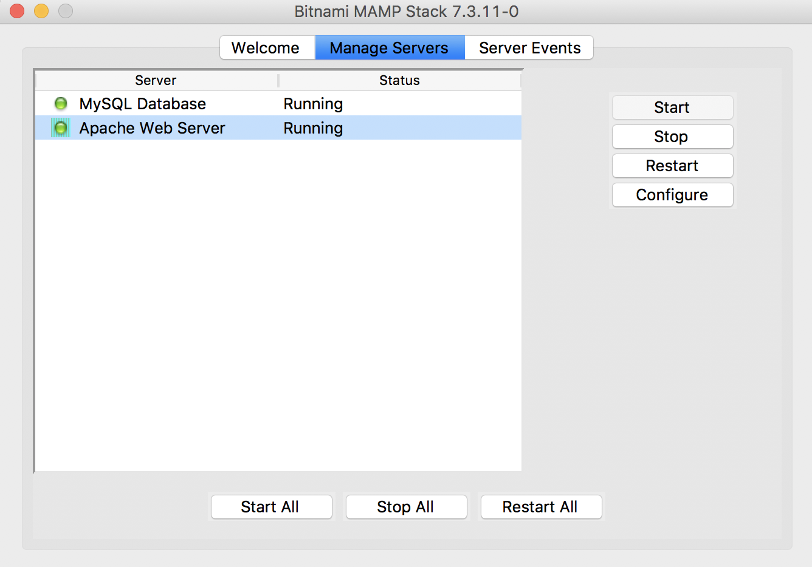
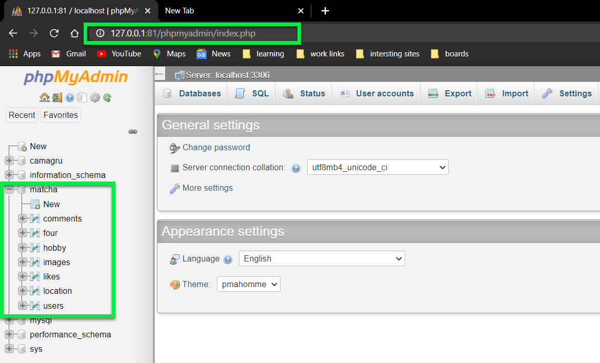
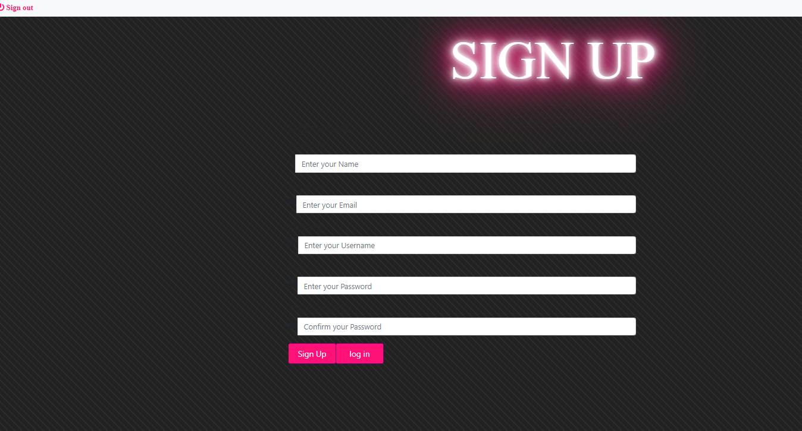
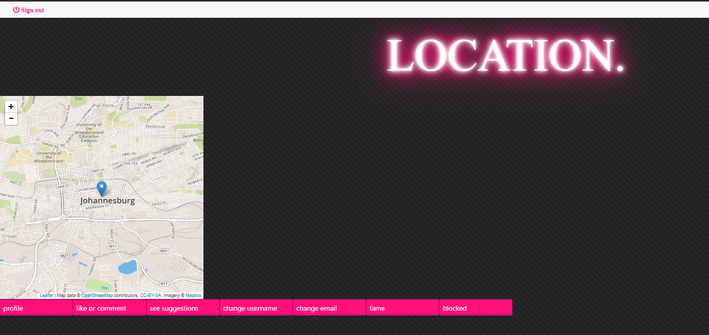
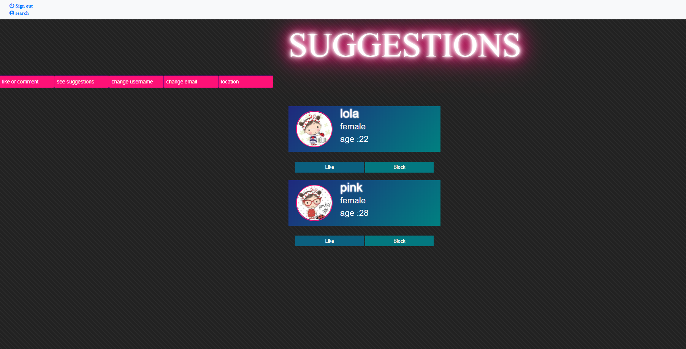
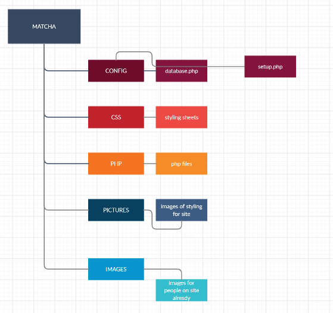

 # Matcha

Whether you're looking for a casual hookup, potential date, friendship or an LTR (long term relationship), Matcha has you covered. It's basically the first stop for those entering the dating world. If you want to play the odds when it comes to online dating, you need to be in it.

It is the second Web Project of WeThinkCode_

# Installation

## Prerequisites

A local apache server to host on, in this case we will make use of bitnami local server environments

   - [Bitnami local server environments](https://bitnami.com/stacks/infrastructure)
   
### MacOS

 - Install [Bitnami MAMP](https://bitnami.com/stack/mamp)

### Windows

 - Install [Bitnami WAMP](https://bitnami.com/stack/wamp)

### Linux

> NOTE - this project hasn't been tested on a linux based system

 - Install [Bitnami LAMP](https://bitnami.com/stack/lamp)


# Clone

Clone this repo to your local machine using:

```
cd [Insert path to your MAMP/ WAMP / LAMP Directory ]/apache2/htdocs
git clone https://github.com/PollySambo/matcha
```

# Setup
## Configuring Server Environment


Locate and run the executable file



Start the server



Browse to site location
http://localhost/Matcha
> NOTE - by default the server is set to port 80  or 81 

## Configuring Matcha

### Changing Matcha Variables 

In [Insert path to your MAMP/ WAMP / LAMP Directory ]/apache2/htdocs/Matcha/config/database.php  

Change the password of `$DB_PASSWORD`, to the password chosen during from bitnami setup.


### Checking the Tables are created

In the browser, navigate to  
http://localhost/phpmyadmin/sql.php



## Authors

  > **Polite Sambo** - *Student @* - [WeThinkCode_](https://github.com/PollySambo)

# Samples | Screenshots

## Sign Up Page



## Location Page



## suggestions




# Project insight

## Project Brief
- [Matcha Project Brief](./images/github/matcha.en.pdf)


## Project Stack / Technologies
### Front-End
- HTML
- CSS
- Javascript

### Back-End
- [PHP](https://www.php.net/)
  
### Databse
- [MySQL](https://www.mysql.com/)
- [phpMyAdmin](https://www.phpmyadmin.net/)

## References | Attributes  
- [Stickers and Icons - just gifs](https://www.justgags.com)


## Project File Structure
